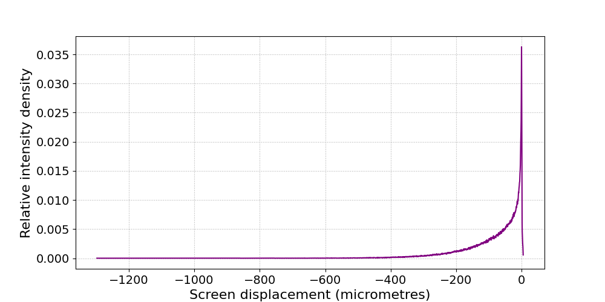
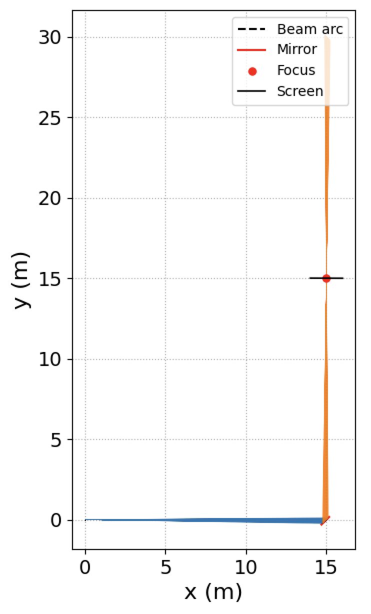

# README for AFM_toolkit

### Intro

The AFM_toolkit is a collection of programs to define and test the shape of Arc Focussing Mirrors.

To understand what AFMs are I recommend the reading of this [article](AFM_report.pdf).


### Example run (default config)

```
> $python3  AFM_runner.py

Free-form mirror simulation
Configuration: config.json
Mirror definition complete (4.77s)
Mirror: $y=0.00375847443316x^{3} - 0.102473708746x^{2} + 1.53724078866x - 12.6868785754$
Domain: (14.880374996208612, 15.0)

Tracing complete: 250,000 rays in 4.53s (55,137 rays/s)
Mirror testing complete (6.21s)
Hits: 250,000/250,000
Mirror function (LaTeX): $y=0.00375847443316x^{3} - 0.102473708746x^{2} + 1.53724078866x - 12.6868785754$
Mirror domain: (14.880374996208612, 15.0)
Peak intensity: 0.0363066
50% ray collection width: 106.55 µm
Total runtime: 10.98s
Close the graph windows to finish.
```





### User guide

The user guide and software requirments can be found [here](User_Guide.md).


### How this repository was made

The algorithm for defining the AFM was originally written by me. I have then used Google Gemini and Github Copilot assistants to vastly develop it into the full python toolkit. This README and [AFM Report](AFM_Report.pdf) is written entirely by me with feedback from my supervisor as mentioned in the report. The [User_Guide](User_Guide.md) is written entirely by Gemini AI after analysing the program and report.